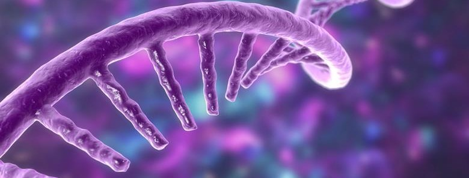
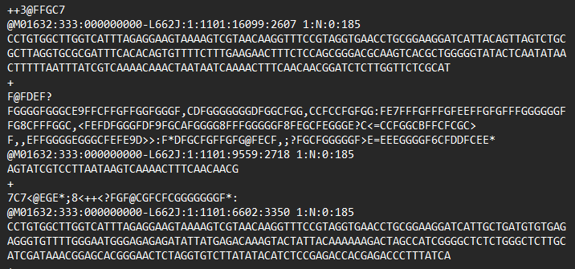
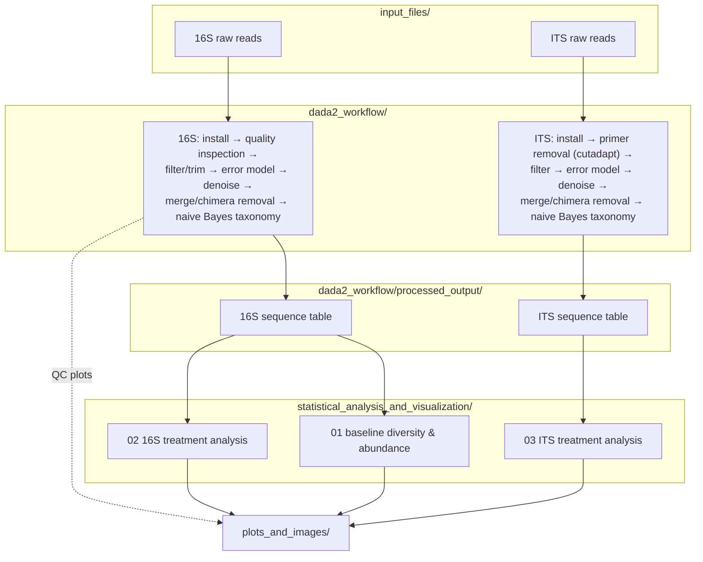
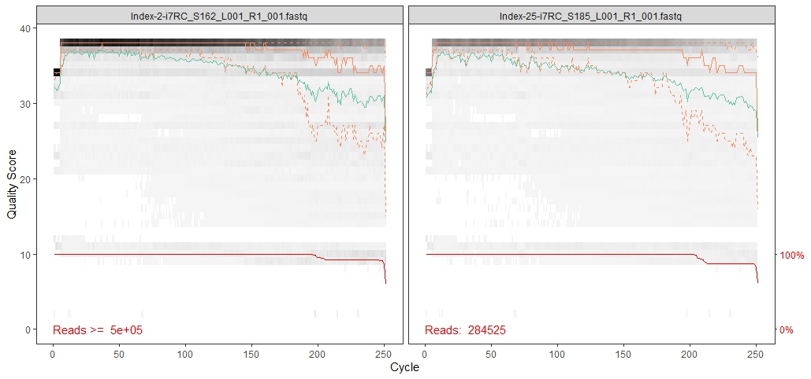
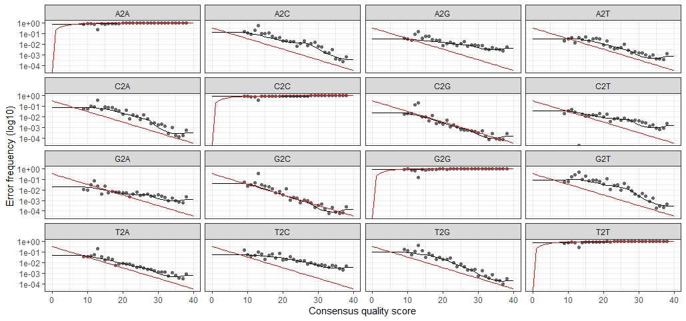
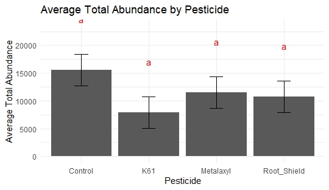
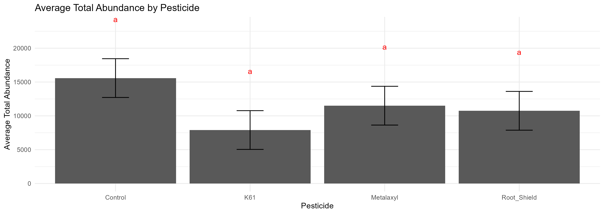

# Divisive Amplicon-sequence Denoising Algorithm, Applied to Bacterial and Fungal DNA Identification

A pipeline that takes raw, error-prone DNA sequencing reads and works out
exactly which organisms they came from, down to the individual genetic
variant, then runs statistical and machine-learning models on the result to
test hypotheses across experimental groups.

Millions of short, noisy DNA reads (~20 GB of raw paired-end sequencing data)
go in; a clean table of exact genetic signatures per organism, per sample,
comes out. Two marker genes are processed in parallel: **16S rRNA**
(bacteria) and **ITS** (fungi), the standard "barcode" regions used to
identify microorganisms from a DNA sample without culturing them.

This repository was produced by Simao Rafique, MSc student at Newcastle
University (2023-24), as part of an MSc dissertation project. See
[LICENSE](LICENSE) for data ownership, scope, and usage terms.

## Why this is here

I wanted a public record of the full analysis journey, from raw reads,
through the denoising and classification pipeline, to the statistical
analyses that answered the project's different experimental questions, that
a visitor can read through without needing to run anything locally.

## Where biology, data science, and machine learning meet

This project sits squarely at the intersection of three fields, and each
stage of the pipeline draws on a different one:

| Field | Where it shows up here |
|---|---|
| **Biology / molecular genetics** | Marker gene selection (16S rRNA for bacteria, ITS for fungi), primer design, PCR chimera artifacts, taxonomic reference databases (Silva, UNITE) |
| **Machine learning** | A data-driven error model learned per sequencing run, a divisive hierarchical-clustering-style denoising algorithm, naive Bayes classification for taxonomy |
| **Data science / statistics** | Information-theoretic diversity metrics, generalized linear modeling (DESeq2) for differential abundance, ANOVA/Tukey HSD hypothesis testing with assumption checks |

None of these stages work in isolation: the biology determines what the
data means, the machine-learning stage turns noisy raw signal into reliable
genetic variants, and the statistics turn those variants into an answer to
an experimental question.

## The machine-learning and data-processing angle

- **Data-driven noise modeling.** Before anything else, the pipeline learns
  a per-run error model directly from the data: the empirical rate at which
  each base is misread as another, as a function of quality score, rather
  than assuming a generic, textbook error rate.
- **Divisive, hierarchical-clustering-style denoising.** The core algorithm
  (DADA2) starts every sample as one partition and greedily splits off a new
  partition whenever a candidate sequence is statistically too abundant to
  be explained as noise around its partition's center, under the learned
  error model. It converges on the true set of distinct DNA sequences with
  no fixed similarity threshold, unlike classic OTU clustering.
- **Naive Bayes classification.** Every recovered DNA sequence is identified
  by comparing its k-mer frequency profile against a reference database
  using the RDP naive Bayesian classifier (Wang et al., 2007), producing a
  taxonomic call with a bootstrap confidence score at each rank.
- **Information theory.** Two of the headline statistics, Shannon and
  Simpson diversity, are literally Shannon entropy and a probability-based
  evenness measure, borrowed straight from information theory, applied to
  "how many different organisms, how evenly distributed."
- **Generalized linear modeling.** Differential-abundance testing
  (`DESeq2`) fits a negative-binomial GLM per organism to find which ones
  respond significantly to treatment, correcting for multiple testing.
- **Classical statistical inference.** ANOVA and Tukey HSD post-hoc testing
  are used throughout to test whether experimental groups differ
  significantly, with variance-homogeneity and normality checks (Levene's,
  Shapiro-Wilk) and non-parametric fallbacks (Kruskal-Wallis, Dunn's test)
  where assumptions don't hold.

## Data

The full raw dataset comprised **191 paired 16S samples and 191 paired ITS
samples (~20 GB of paired-end FASTQ reads)**. This repository includes **4
example FASTQ files** (one forward/reverse pair for 16S, one for ITS) under
[`input_files/`](input_files/) to illustrate the raw input format. The full
raw archive is not published here. See [LICENSE](LICENSE) for details.



## Methodology

Reads were processed with [DADA2](https://benjjneb.github.io/dada2/)
(Callahan et al.), which infers exact amplicon sequence variants (ASVs),
individual genetic variants at single-nucleotide resolution, rather than
clustering reads into coarser, similarity-threshold OTUs. **This repository
does not claim authorship of the DADA2 pipeline**, only of its application
here to this project's own sequencing data, and of the downstream
statistical analysis and visualization built on top of its output. The
workflow scripts in [`dada2_workflow/`](dada2_workflow/) follow DADA2's own
tutorials directly: [16S tutorial](https://benjjneb.github.io/dada2/tutorial.html)
and [ITS workflow](https://benjjneb.github.io/dada2/ITS_workflow.html).

The pipeline, in order:

1. **Quality filtering and trimming** (`filterAndTrim`): reads are trimmed
   to a fixed length (16S) or filtered on expected error rate and minimum
   length only (ITS, since amplicon length varies naturally), discarding
   low-quality and ambiguous-base reads before any inference step.
2. **Error-model learning** (`learnErrors`): see above.
3. **Denoising** (`dada`): the core algorithm; see above.
4. **Paired-read merging and chimera removal** (`mergePairs`,
   `removeBimeraDenovo`): forward/reverse ASVs are merged into full
   genetic sequences, and chimeric sequences formed by PCR artifacts are
   detected and discarded.
5. **Taxonomy assignment** (`assignTaxonomy`,
   `dada2_workflow/*/0*_taxonomy_assignment.R`): naive Bayes classification
   against a reference database (Silva for 16S, UNITE for ITS). Reference
   training files are large (hundreds of MB) and not included in this
   repository; see the script comments for download links.

Downstream, three statistical analyses were carried out on the resulting
sequence tables, each addressing a different question:

| Module | Question | Data |
|---|---|---|
| [`01_baseline_diversity_abundance`](statistical_analysis_and_visualization/01_baseline_diversity_abundance/) | Baseline diversity and abundance across samples | 16S |
| [`02_16S_treatment_analysis`](statistical_analysis_and_visualization/02_16S_treatment_analysis/) | Treatment/block comparisons (DESeq2) and pesticide/pathogen abundance across two timepoints | 16S |
| [`03_ITS_treatment_analysis`](statistical_analysis_and_visualization/03_ITS_treatment_analysis/) | Same treatment/timepoint analysis, fungal counterpart | ITS |

### Workflow diagram



A more illustrated version of this diagram may replace this Mermaid version
in the future.

## Key results



Forward-read quality profile inspected before filter/trim.



Learned per-run error rates from `learnErrors()`, DADA2's noise model.



Abundance by pesticide treatment, with statistical group comparisons.



Mean total abundance by pesticide treatment.

All figures produced across the workflow and the three analysis modules are
collected in [`plots_and_images/`](plots_and_images/).

## Repository structure

```
amplicon-sequence-algorithm-ncl/
├── README.md
├── LICENSE
├── .gitignore
│
├── input_files/
│   ├── 16S_example/                          # example 16S raw read pair
│   └── ITS_example/                          # example ITS raw read pair
│
├── dada2_workflow/
│   ├── 16S/
│   │   ├── 00_install_dada2.R
│   │   ├── 01_quality_inspection.R
│   │   ├── 02_filter_and_trim.R
│   │   ├── 03_dada2_pipeline.R               # denoise, merge, chimera removal
│   │   └── 04_taxonomy_assignment.R          # naive Bayes classification (Silva)
│   └── ITS/
│       ├── 00_install_dada2.R
│       ├── 01_primer_check_and_trim.R        # cutadapt primer removal
│       ├── 02_dada2_pipeline.R               # filter, denoise, merge, chimera removal
│       └── 03_taxonomy_assignment.R          # naive Bayes classification (UNITE)
│
├── statistical_analysis_and_visualization/
│   ├── 01_baseline_diversity_abundance/      # baseline 16S diversity & abundance
│   ├── 02_16S_treatment_analysis/            # 16S treatment/block/timepoint analysis
│   └── 03_ITS_treatment_analysis/            # ITS counterpart of the above
│
└── plots_and_images/                          # every figure produced across the project
```

## Limitations

- The taxonomy-assignment steps (`dada2_workflow/*/0*_taxonomy_assignment.R`)
  require reference training files (Silva for 16S, UNITE for ITS) that are
  too large to include in this repository, and the ITS primer-removal step
  requires `cutadapt` installed separately. See each script's header
  comments for details. The original dissertation scripts referenced a Silva
  path that was never resolved to a real file, so it's unclear whether
  taxonomic assignment was completed in the original run; these scripts
  complete that step following DADA2's own tutorials.
- The workflow scripts are included to document the method applied, not as a
  runnable end-to-end pipeline against the full dataset. They operate on
  the 4-file example subset in `input_files/`, not the full ~20 GB raw
  archive, which is not published here.
- Some downstream analysis scripts were adapted directly from earlier drafts
  and share filenames across the two 16S/ITS modules where the underlying
  method was reused as-is.
- Several scripts existed in multiple near-duplicate versions (a base
  version, a `_beau` visually-enhanced version, and/or a `_Pub`
  publication-ready version). These have been consolidated: the best/most
  complete version was kept (or the versions merged where each contributed
  distinct content), and superseded duplicates removed. One mismatch found
  in the process: two files named `..._Abundance_ASV_New.R` and
  `..._Abundance_ASV_beau.R` actually contained a Shannon-diversity plot, not
  abundance content, likely a copy-paste mixup during the original
  drafting. Their content was merged into the diversity script instead.
- A handful of scripts in `01_baseline_diversity_abundance/` reference an
  input file (`Seqtab_Linked_TP2.csv` or `Seqtab_Pareto.csv`) that was not
  among the recovered project files, flagged in each script's header.
- Narrative `.docx` write-ups produced during the project are not tracked in
  this repository (see `.gitignore`).

## Attribution and data provenance

- Amplicon sequence variant inference: [DADA2](https://benjjneb.github.io/dada2/), Callahan et al.
- Sequencing data and experimental design: Newcastle University research project (see [LICENSE](LICENSE)).
- All downstream statistical analysis, visualization, and repository organization: Simao Rafique, MSc student, Newcastle University (2023-24).
